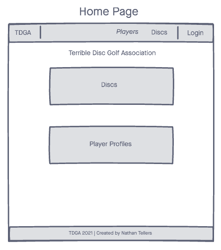
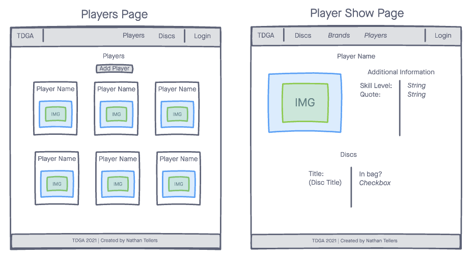

# TDGA - Terrible Disc Golf Association
Welcome to the Terrible Disc Golf Association. This website allows users to create personal player profiles and connect to a database to "add discs to your bag."

## Technologies
- HTML5
- CSS3
- JavaScript
- MongoDB
- Express
- Mongoose
- Node

## ERD

## Wireframes
### Home Page

### Players

### Discs

## Getting Started
[Click here to become a TDGA Member today!](https://tdga.herokuapp.com/)

## Future Enhancements
1. Create _Players_ page.
2. Add _OAUTH_ so users can sign in via **Google** and create their own _Player Profile_. 
3. Create _Review Model_ so users can rate discs added to the database. 